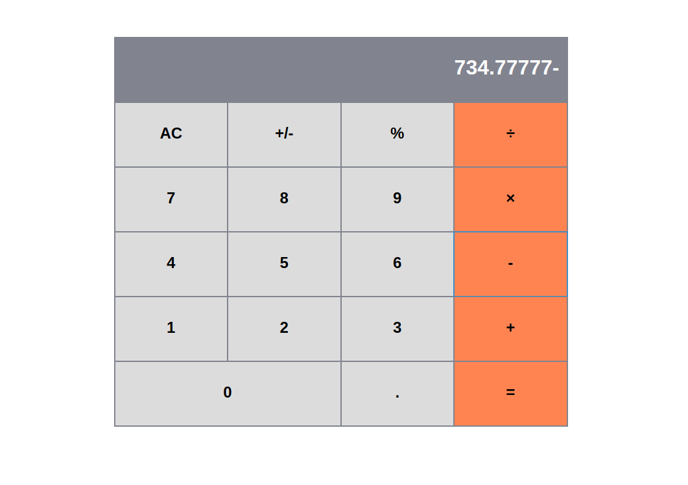

# Calculator

#### Calculator app built using React library

### Installing dependencies

In order to successfully install dependencies and run the application, it is required to have Node.js and npm installed. Further instructions for downloading and installing Node can be found on [official Node website](https://nodejs.org/en/)

`npm install`

### Running the application locally

`npm start`